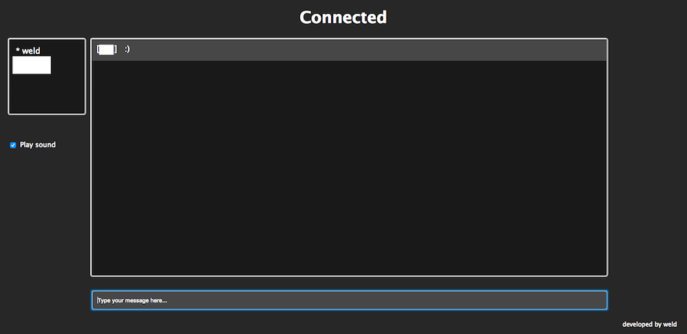
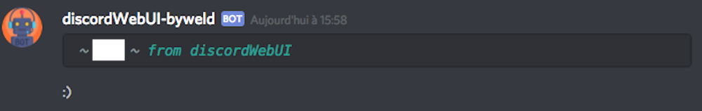

# discordWebUI

A simple web interface for discord using websockets and discord.js

## Purpose

This is a simple discord interface using websockets, node and the discordjs library. The original purpose was to learn the basics of websockets and how to use nodejs to write a complete webapp.

It embeds a very simple, written from scratch, http server ; wsockets are handled by socketIO and discuss with discord's server through the discord.js library. 

### Improvements

The project follows the common MVC pattern. It lacks certain features (no session, plain db, history, ...) on which I'm currently working on.

## Screenshots

From the Web interface

From discord

## Setting up the whole thing

First install node, then run

`npm install`

Add a new user in ./app/models (follow the example.json file)

`touch new_user.json`

Add the bot's token (you can retrieve it on the dc website) and the channel on which it will be used inside the ./app/config/bot_config.json

Default port is 8080, you can change it for whatever you want to inside the ./app/config/server_config.json file.

Finally, run :

`node server.js`

It works ! Access the UI from your web browser.

## About

Developed by weld
MIT license